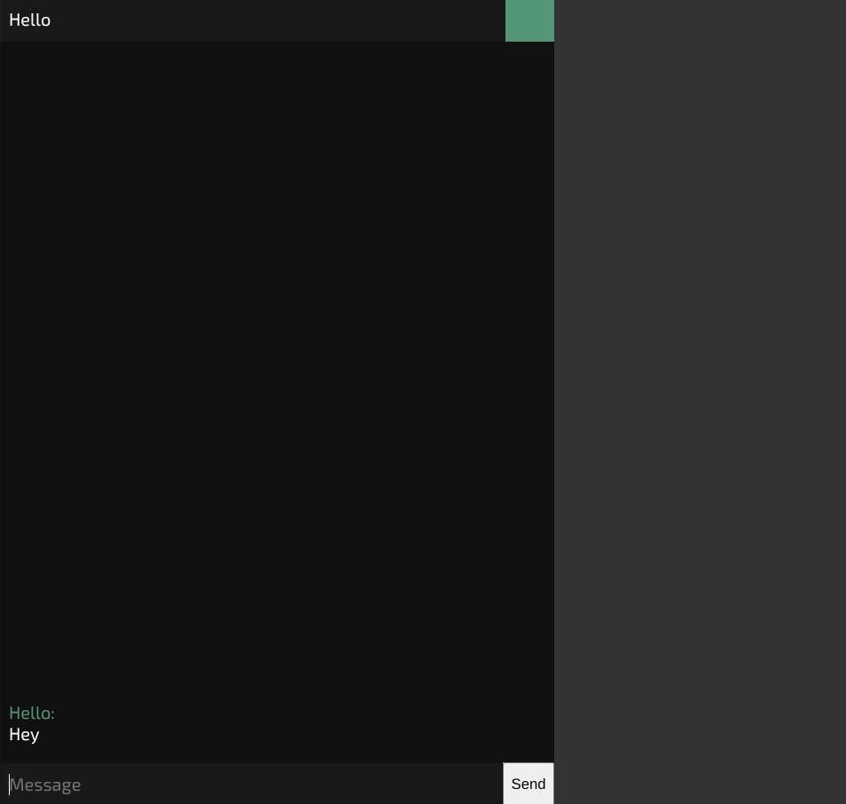

## What this chat actually looks like


## Features of this chat
- Change username color
- Gives randomized "Guest____" username without a cookie (new user)
- Gives randomized username color without a cookie (new user)
- Remembers the last username color you had
- Remembers the last username you had
- Looks eerily similar to iogames chat (same font)
- Messages always start from the bottom, and every page reload always starts at the bottom of page
- Very fast
- Broadcasts the last 30 or so messages (remembers old messages, even when page reloads)
- Extremely small codebase (less than 200(!!!) loc (not including picows library))
- Exposed websocket protocol, so you can directly connect to the chat with a custom web client
- Based on python (cython) backend
- Is open source so you can customize it to your liking
- When connection is lost, it will reconnect every two seconds
- Multiple chatrooms support
- Spam detection and blocking support
- Should work with reverse proxy, or direct
- Chatrooms easy to add or remove using data/chatrooms.txt

## If using reverse proxy and want to block ip addresses for spam:
Put this config in your reverse proxy for this python script to read the header's forwarded client's ip address.

```
location / {
    proxy_pass http://YOUR-SERVER-IP-ADDRESS:8001;
    proxy_http_version 1.1;
    proxy_set_header Upgrade $http_upgrade;
    proxy_set_header Connection "upgrade";
    proxy_set_header Host $host;
}   
```
## Chat Example

This application shows how to use the
[picows](https://github.com/tarasko/picows) (python3 websocket) package library to implement a simple
web chat application.

## Running the example

The example requires a working Python3 development environment.
Once you have Python3 up and running, you can download, build and run the example
using the following commands.

    $ chmod +x ./run.sh && ./run.sh

To use the chat example, open http://127.0.0.1:8000 or http://localhost:8000 in your browser.

## Running the docker container 

    $ mkdir docker-chat
    $ cd docker-chat
    $ git clone https://github.com/tkrclient/pygames-chat
    $ mv pygames-chat/docker/docker-compose.yml \
    pygames-chat/docker/Dockerfile \
    pygames-chat/docker/run.sh ./
    $ chmod +x ./run.sh && ./run.sh

- features a tiny ~13mb docker from scratch container 😎, for only the minimum needed (python3, picows, websocket.py all compiled into a single static executable binary) (no init system, no kernel, no os libraries, no os packages, no linux distro, just the app itself)
- tiny for extreme security, and easy codebase maintainability 😎
- whole container is read-only except for data and tmp, which is a mounted volume and anonymous volume
- drop capability privileges

To Do:
- run 13mb executable app in a tmpfs, so will be running on ram ( don't worry chat logs are persistent since in its own mount volume anyway ;) )
